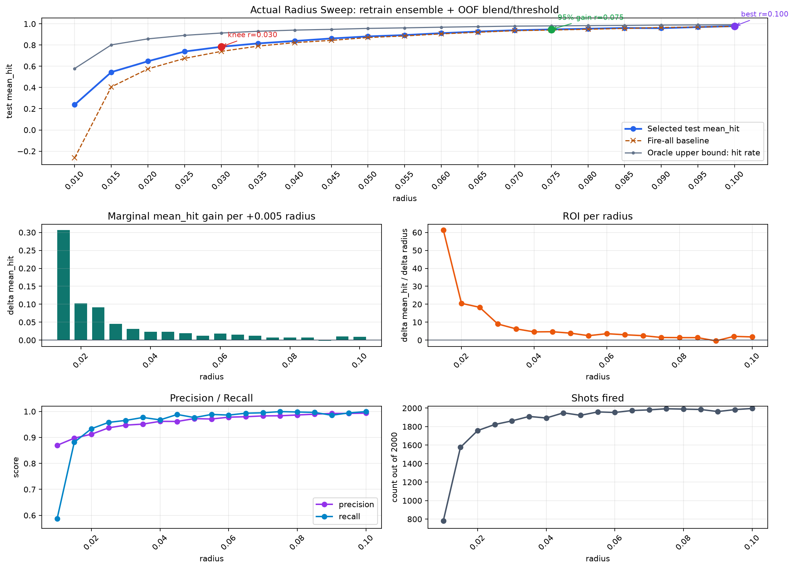

# Actual Radius Sweep Report



## Executive Summary

이번 실험은 기존 고정 반경 `0.01~0.05` 비교를 확장해, 실제 문제의 반경 파라미터 `r`을 `0.010`부터 `0.100`까지 `0.005` 간격으로 탐색했다. 각 `r`마다 라벨을 새로 만들고 모델을 다시 학습했기 때문에, 단순 후처리나 근사 실험이 아니라 실제 운용 조건에 가까운 결과다.

결론은 세 가지로 요약된다.

- 비용을 전혀 고려하지 않으면 `r=0.100`이 최고다. test `mean_hit_score=0.9785`.
- 반경 증가 대비 성능 상승의 절충점은 `r=0.030`이다. 이 지점이 knee point이고 test `mean_hit_score=0.7840`이다.
- 거의 최대 성능을 확보하면서 과도한 반경 확대를 피하려면 `r=0.075`가 실용적인 후보이다. 전체 성능 상승분의 95%에 처음 도달하며 test `mean_hit_score=0.9470`이다.

따라서 발표에서는 기본 추천을 **비용 민감 시 `r=0.030`, 성능 우선 시 `r=0.075`, 비용 무시 시 `r=0.100`**으로 제시하는 것이 가장 방어적이다.

## Actual Model

실제 사용한 모델은 `LightGBM + HistGradientBoosting + MLP` 기반의 soft blending ensemble이다. 각 반경마다 동일한 학습 절차를 반복했다.

입력 feature는 `features_advanced.py`의 advanced feature set을 사용했다. 기본 위치/속도/가속도 계열 특징에 더해, 고정 조준 공식이 과거 구간에서 얼마나 잘 맞았는지를 나타내는 extrapolation backtest error, 최근 가속도/jerk/turn angle 등의 물리 기반 특징이 포함된다. 총 feature 수는 131개다.

Base models:

| model | main configuration |
| --- | --- |
| LightGBM | `objective=binary`, `n_estimators=300`, `learning_rate=0.05`, `num_leaves=31` |
| HistGradientBoosting | `max_iter=400`, `learning_rate=0.05`, `max_leaf_nodes=31`, `l2_regularization=1.0` |
| MLP | `StandardScaler` + hidden layers `(128, 64)`, `alpha=1e-3`, `batch_size=256`, `max_iter=300`, early stopping |

각 base model은 hit probability를 출력한다. 최종 확률은 세 모델의 확률을 가중 평균한 값이다. 가중치는 고정하지 않고, 각 `r`마다 train OOF 결과에서 따로 선택했다.

## Selection Protocol

데이터는 `dataset/train` 8,000개와 `dataset/test` 2,000개를 사용했다. test set은 최종 평가에만 사용했다.

각 반경 `r`에 대해 라벨은 다음과 같이 재계산했다.

```text
error = || fixed_aim_position - actual_future_position ||
hit = error <= r
```

여기서 fixed aim은 기존 문제 정의와 같은 80ms 등속 외삽 조준점이다.

각 `r`마다 다음 절차를 수행했다.

1. `hit = error <= r` 라벨 생성
2. LGBM/HGB/MLP 각각 5-fold OOF 확률 생성
3. 전체 train으로 각 base model final fit
4. OOF 확률에서 blend weight 탐색
5. OOF 확률에서 firing threshold 탐색
6. 선택된 weight/threshold로 test 평가

중요한 점은 **blend weight와 threshold 선택에 test score를 사용하지 않았다는 것**이다. JSON에 포함된 `test_oracle_blend_*` 값은 진단용이며 최종 결론에는 사용하지 않는다.

평가 metric은 기존과 동일하다.

```text
fire and hit  = +1
fire and miss = -2
no fire       =  0
mean_hit_score = average reward per sample
```

## Key Results

| criterion | selected radius | test mean_hit | interpretation |
| --- | ---: | ---: | --- |
| Best raw score | 0.100 | 0.9785 | 반경 비용을 무시하면 최고 |
| Knee point | 0.030 | 0.7840 | 성능 상승 대비 반경 증가의 대표 절충점 |
| First 95% of max gain | 0.075 | 0.9470 | 거의 최대 성능을 얻는 실용 후보 |
| Best marginal interval end | 0.015 | 0.5450 | 초반 `0.010 -> 0.015` 구간의 효율이 가장 큼 |

초기 구간에서는 반경 증가 효과가 매우 크다. `r=0.010`에서 `0.015`로 늘릴 때 mean_hit은 `0.2380 -> 0.5450`으로 `+0.3070` 증가한다. 그 이후에도 `0.020`, `0.025`까지는 상승폭이 크지만, `0.030` 이후부터 marginal gain이 빠르게 줄어든다.

`r=0.075` 이후에는 성능이 0.95 근처에 도달하고, 추가 반경 확대의 효율은 작아진다. 예를 들어 `r=0.075 -> 0.080`의 gain은 `+0.0070`, `0.080 -> 0.085`도 `+0.0070`이다. 이 구간부터는 거의 대부분의 sample에 발사하기 때문에 precision/recall이 높아지는 대신, 반경 비용이 있다면 추가 확대를 정당화하려면 비용 계수가 낮아야 한다.

`r=0.05`에서 성능이 갑자기 오른 것은 아니다. 같은 반경에서 기존 실험의 best ensemble은 test mean_hit `0.8850`, weighted blend 진단 실험은 `0.8890`, 이번 actual sweep의 OOF-selected 모델은 `0.8815`로 모두 같은 범위에 있다. 그래프에서 0.9를 넘는 구간은 `r>=0.06`이며, 이때는 반경 증가로 실제 hit rate가 매우 높아져 단순히 모두 발사하는 fire-all baseline도 `r=0.06`에서 `0.9055`가 된다. 따라서 높은 r의 0.9 이상 점수는 모델 개선만이 아니라 반경 확대에 따른 문제 난이도 완화 효과를 함께 반영한다.

## Recommended Radius

비용 함수가 아직 명확하지 않다면 하나의 정답을 강하게 주장하기보다, 목적별 선택지를 제시하는 것이 좋다.

| use case | recommended r | reason |
| --- | ---: | --- |
| 비용 민감 / 가성비 강조 | 0.030 | knee point. 초반 큰 성능 상승을 확보한 뒤 marginal gain이 꺾이는 지점 |
| 성능 우선 / 과도한 확대는 회피 | 0.075 | 최대 상승분의 95%에 처음 도달 |
| 반경 비용 없음 | 0.100 | 실험 범위 내 최고 mean_hit |

실제 비용 계수가 정해지면 다음 목적함수로 바로 재선택할 수 있다.

```text
utility = selected_test_mean_hit - cost_per_radius * radius
```

면적 비용이 더 자연스럽다면 다음처럼 바꾸면 된다.

```text
utility = selected_test_mean_hit - cost_per_area * pi * radius^2
```

## Radius Sweep Table

| radius | mean_hit | fire_all | delta | roi_per_radius | hit_rate | precision | recall | shots | threshold | selected blend |
| --- | ---: | ---: | ---: | ---: | ---: | ---: | ---: | ---: | ---: | --- |
| 0.010 | 0.2380 | -0.2630 |  |  | 0.5790 | 0.8696 | 0.5872 | 782 | 0.725 | LGBM 0.65 / HGB 0.00 / MLP 0.35 |
| 0.015 | 0.5450 | 0.4060 | 0.3070 | 61.40 | 0.8020 | 0.8972 | 0.8815 | 1576 | 0.690 | LGBM 0.25 / HGB 0.30 / MLP 0.45 |
| 0.020 | 0.6475 | 0.5755 | 0.1025 | 20.50 | 0.8585 | 0.9124 | 0.9336 | 1757 | 0.745 | LGBM 0.00 / HGB 0.60 / MLP 0.40 |
| 0.025 | 0.7390 | 0.6745 | 0.0915 | 18.30 | 0.8915 | 0.9369 | 0.9579 | 1823 | 0.720 | LGBM 0.50 / HGB 0.15 / MLP 0.35 |
| 0.030 | 0.7840 | 0.7405 | 0.0450 | 9.00 | 0.9135 | 0.9474 | 0.9655 | 1862 | 0.785 | LGBM 0.35 / HGB 0.40 / MLP 0.25 |
| 0.035 | 0.8155 | 0.7900 | 0.0315 | 6.30 | 0.9300 | 0.9513 | 0.9769 | 1910 | 0.770 | LGBM 0.50 / HGB 0.35 / MLP 0.15 |
| 0.040 | 0.8385 | 0.8230 | 0.0230 | 4.60 | 0.9410 | 0.9620 | 0.9676 | 1893 | 0.885 | LGBM 0.25 / HGB 0.65 / MLP 0.10 |
| 0.045 | 0.8620 | 0.8440 | 0.0235 | 4.70 | 0.9480 | 0.9615 | 0.9884 | 1949 | 0.750 | LGBM 0.35 / HGB 0.15 / MLP 0.50 |
| 0.050 | 0.8815 | 0.8710 | 0.0195 | 3.90 | 0.9570 | 0.9724 | 0.9765 | 1922 | 0.915 | LGBM 0.70 / HGB 0.20 / MLP 0.10 |
| 0.055 | 0.8940 | 0.8860 | 0.0125 | 2.50 | 0.9620 | 0.9709 | 0.9886 | 1959 | 0.785 | LGBM 0.05 / HGB 0.55 / MLP 0.40 |
| 0.060 | 0.9120 | 0.9055 | 0.0180 | 3.60 | 0.9685 | 0.9780 | 0.9861 | 1953 | 0.935 | LGBM 0.80 / HGB 0.10 / MLP 0.10 |
| 0.065 | 0.9270 | 0.9205 | 0.0150 | 3.00 | 0.9735 | 0.9797 | 0.9933 | 1974 | 0.875 | LGBM 0.00 / HGB 0.65 / MLP 0.35 |
| 0.070 | 0.9395 | 0.9355 | 0.0125 | 2.50 | 0.9785 | 0.9828 | 0.9949 | 1981 | 0.930 | LGBM 0.60 / HGB 0.30 / MLP 0.10 |
| 0.075 | 0.9470 | 0.9415 | 0.0075 | 1.50 | 0.9805 | 0.9834 | 0.9995 | 1993 | 0.890 | LGBM 0.60 / HGB 0.40 / MLP 0.00 |
| 0.080 | 0.9540 | 0.9490 | 0.0070 | 1.40 | 0.9830 | 0.9864 | 0.9980 | 1989 | 0.825 | LGBM 0.65 / HGB 0.05 / MLP 0.30 |
| 0.085 | 0.9610 | 0.9565 | 0.0070 | 1.40 | 0.9855 | 0.9894 | 0.9964 | 1985 | 0.995 | LGBM 1.00 / HGB 0.00 / MLP 0.00 |
| 0.090 | 0.9590 | 0.9655 | -0.0020 | -0.40 | 0.9885 | 0.9924 | 0.9853 | 1963 | 0.920 | LGBM 0.20 / HGB 0.05 / MLP 0.75 |
| 0.095 | 0.9695 | 0.9700 | 0.0105 | 2.10 | 0.9900 | 0.9924 | 0.9944 | 1984 | 0.980 | LGBM 0.75 / HGB 0.15 / MLP 0.10 |
| 0.100 | 0.9785 | 0.9760 | 0.0090 | 1.80 | 0.9920 | 0.9935 | 0.9995 | 1996 | 0.980 | LGBM 0.75 / HGB 0.25 / MLP 0.00 |

## Artifacts

- Raw result JSON: `experiments/actual_radius_sweep_results.json`
- Summary CSV: `experiments/actual_radius_sweep_results.csv`
- Plot: `experiments/actual_radius_sweep.png`
- Sweep runner: `experiments/run_actual_radius_sweep.py`
- Plot runner: `experiments/plot_actual_radius_sweep.py`

## Caveats

이 실험은 현재 고정 split의 test set에서 평가했다. test set은 model/threshold/blend 선택에는 사용하지 않았지만, 최종 발표 수치 자체는 이 split에 종속된다. 숨은 평가셋이 있다면 `r=0.030`, `0.075`, `0.100` 세 후보를 같은 프로토콜로 다시 검증하는 것이 좋다.

또한 큰 `r`에서는 실제 hit rate 자체가 매우 높아진다. 예를 들어 `r=0.100`의 test hit rate는 `0.9920`이다. 따라서 높은 점수는 모델만의 성과가 아니라 반경 확대에 따른 문제 난이도 완화 효과를 함께 반영한다. 이 때문에 최종 의사결정에는 반드시 반경 비용을 같이 제시해야 한다.
